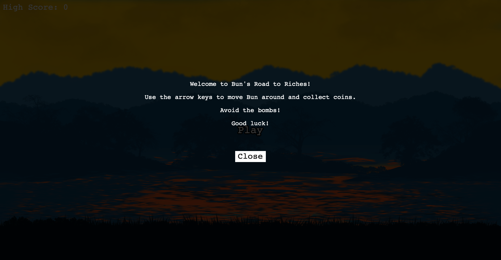
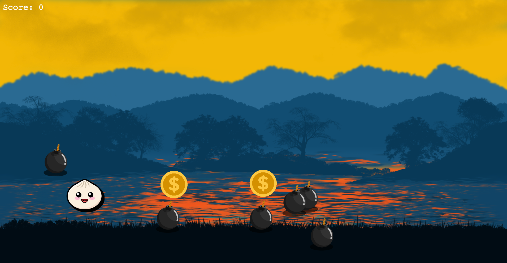
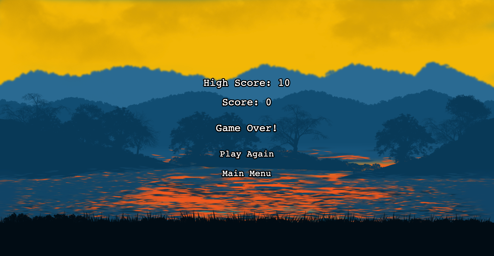

# Bun's Road to Riches

## Overview

Bun's Road to Riches is an engaging arcade-style game where players guide Bun to collect coins and avoid bombs in a
dynamic, physics-driven environment.

## Preview

#### Main Menu Screen



#### Gameplay Screen



#### Game Over Screen



## Features

- Physics-driven gameplay for realistic interactions.
- Dynamic environment with moving objects.
- Score tracking and game over screen.
- Responsive design for seamless gameplay.

## Getting Started

### Prerequisites (one is sufficient)

- [Bun](https://bun.sh)
- [Node.js](https://nodejs.org/en)

## Usage

1. Clone the repository:
   ```bash
   git clone git@github.com:edwardinio18/Buns-Road-to-Riches.git
   ```
2. Change directory to the project folder:
   ```bash
   cd Buns-Road-to-Riches
   ```
3. Install the required dependencies with the package manager of your choice.
   ```bash
   bun install
   ```
4. Start the game:
   ```bash
   bun run dev
   ```
5. Open your browser and navigate to `http://localhost:8080`.

## Contributing

Contributions are welcome and greatly appreciated. If you have suggestions for improving this application, please fork
the repo and create a pull request or open an issue.

1. Fork the Project
2. Create your Feature Branch (`git checkout -b feature/AmazingFeature`)
3. Commit your Changes (`git commit -m 'Add some AmazingFeature'`)
4. Push to the Branch (`git push origin feature/AmazingFeature`)
5. Open a Pull Request

## License

This project is licensed under the MIT License - see the [LICENSE](LICENSE) file for details.